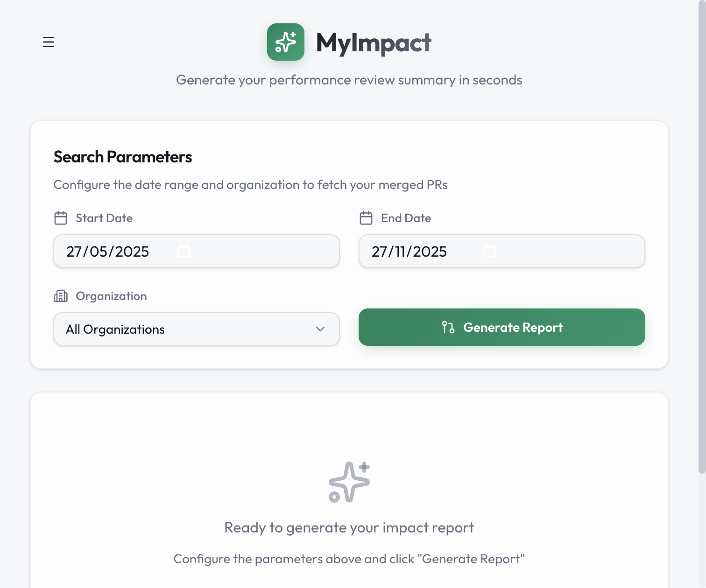

# ✨ MyImpact

[](https://github.com/robertoeb/my-impact/actions/workflows/ci.yml)

> Generate your performance review summary in seconds using GitHub CLI and AI



## 🎯 What is MyImpact?

**MyImpact** is a desktop application that helps developers generate comprehensive performance review summaries by analyzing their GitHub contributions. It uses the local GitHub CLI (`gh`) to fetch your PR data and OpenAI to generate professional summaries.

## ✨ Features

### 📊 Analytics Dashboard
- **PRs Merged** — Total pull requests merged in the selected period
- **PRs Reviewed** — Code reviews you've contributed to
- **Organizations** — Companies/orgs you've contributed to
- **Repositories** — Repos with your merged PRs
- **Avg Time to Merge** — How fast your PRs get merged
- **Contribution Streak** — Longest streak of weekly contributions
- **Unique Collaborators** — Teammates you've helped through reviews

### 📈 Visual Charts
- **Monthly Trends** — Bar chart of PRs over time
- **Organization Distribution** — Pie chart by org
- **Repository Breakdown** — Top repos by contribution
- **Contribution Heatmap** — GitHub-style activity visualization

### 🤖 AI-Powered Summaries
- Generate professional performance review text
- Powered by OpenAI GPT-4
- Edit and customize the output
- Markdown formatting support
- Copy to clipboard

### 📅 Smart Date Picker
- Calendar with month/year dropdowns
- Easy navigation between years
- Localized date formats

### 📊 Period Comparison
- Compare current period vs previous
- See growth/decline percentages
- Track improvement over time

### 💾 Report Management
- Save reports for later
- Update saved reports with new AI summaries
- Load and delete reports
- Export as PDF

### 🎨 User Experience
- **Dark Mode** — System, light, or dark theme
- **Internationalization** — English and Portuguese (Brazil)
- **Native macOS** — Traffic light buttons, drag regions
- **Responsive** — Clean UI with smooth animations

## 🛠️ Tech Stack

| Layer | Technology |
|-------|------------|
| **Framework** | [Tauri v2](https://tauri.app/) |
| **Frontend** | React 19 + TypeScript + Vite |
| **Styling** | Tailwind CSS v4 + shadcn/ui |
| **Backend** | Rust |
| **Data Source** | GitHub CLI (`gh`) |
| **AI** | OpenAI API (GPT-4o-mini) |
| **PDF** | html2pdf.js |

## 📋 Prerequisites

1. **GitHub CLI** installed and authenticated
   ```bash
   # Install (macOS)
   brew install gh
   
   # Authenticate
   gh auth login
   ```

2. **Node.js** (v18+) and **npm**

3. **Rust** (for Tauri)
   ```bash
   curl --proto '=https' --tlsv1.2 -sSf https://sh.rustup.rs | sh
   ```

4. **OpenAI API Key** (optional, for AI summaries)
   - Get your key at [platform.openai.com](https://platform.openai.com/api-keys)

## 🚀 Getting Started

### Development

```bash
# Clone the repository
git clone https://github.com/robertoeb/my-impact.git
cd my-impact

# Install dependencies
npm install

# Run in development mode
npm run tauri dev
```

### Build for Production

```bash
# Build the app
npm run tauri build

# macOS: Find the installer at
# src-tauri/target/release/bundle/dmg/MyImpact_x.x.x_aarch64.dmg
```

## ⚙️ Configuration

### Settings

Access via the menu (☰) → Settings:

- **Theme**: System / Light / Dark
- **Language**: English (US) / Português (Brasil)
- **OpenAI API Key**: Required for AI summaries

### Data Storage

All data is stored locally in `~/.myimpact/`:
- `settings.json` — Preferences and API key
- `reports.json` — Saved reports

## 📖 Usage

1. **Set Date Range** — Choose the review period
2. **Select Organization** — Filter by org or view all
3. **Generate Report** — Fetch your PR data
4. **Explore**:
   - **Overview** — Charts and metrics
   - **Pull Requests** — Detailed PR list
   - **AI Summary** — Generate your summary
5. **Compare** — Compare with a previous period
6. **Export** — Save as PDF or save the report

## 🔒 Privacy

- ✅ GitHub data fetched locally via `gh` CLI
- ✅ API key stored locally only
- ✅ No analytics or tracking
- ✅ No data sent to third parties (except OpenAI for summaries)

## 🧪 Testing

```bash
# Run tests
npm run test

# Run tests once
npm run test:run

# Run with coverage
npm run test:coverage

# Run Rust tests
cd src-tauri && cargo test
```

## 🤝 Contributing

Contributions are welcome! Feel free to submit a Pull Request.

## 📄 License

MIT License — see [LICENSE](LICENSE) for details.

## 👨‍💻 Author

**Roberto Eustáquio**

[](https://github.com/robertoeb)
[](https://www.linkedin.com/in/robertoeb/)
[](https://www.robertoeb.com/)

---

<p align="center">
  Made with ❤️ using Tauri, React, and Rust
</p>
